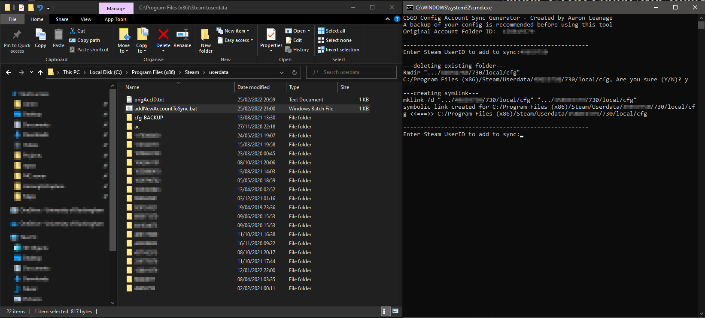

# Simple CS:GO Config Sync Utility - Windows Only

This tool will enable you to sync your config automatically between CS:GO Accounts. To start, type in the account ID  you want all accounts to sync with (your existing config) to `origAccID.txt`. To add a new account, simply run the utility. 

## Additional Notes
NOTE: This utility assumes your Steam files (not your game library) are in the default location on an x64 machine (C:/Program Files (x86)/Steam).
ㅤ

This utility uses two files:

`addNewAccountToSync.bat`

`origAccID.txt`

Both of these files can be located anywhere on your machine provided they are in the same folder.

## Screenshot

